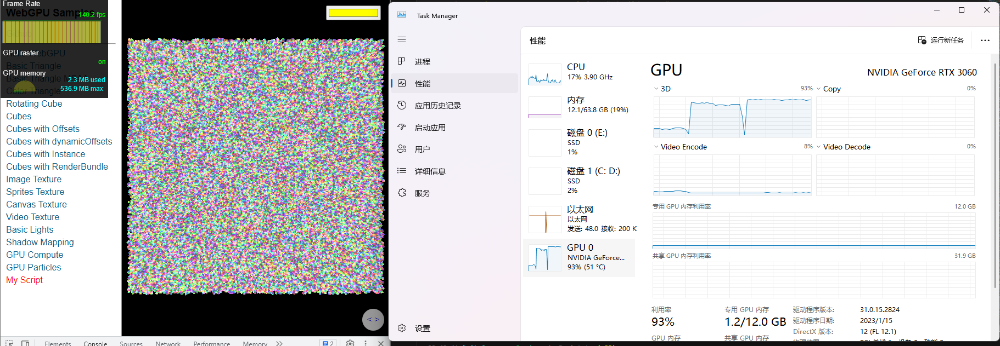
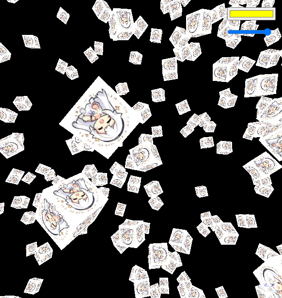

#  Learning WebGPU ...

## 1. 来源

* Orillusion的WebGPU教程
  * [Github](https://github.com/Orillusion/orillusion-webgpu-samples)
  * [Bilibili](https://space.bilibili.com/1006136755/channel/collectiondetail?sid=385157)

## 2. 我自己实现的效果

* 渲染100w个正方体
  * 无旋转
  * 将CPU和GPU的数据交换次数优化到最少（每次渲染不进行数据交换）
  * 3060 12G可以跑到155fps，gpu占用率跑到93%
  * 

* 渲染星绘正方体
  * 实际上就是简单的纹理贴图
  * 
  * 可爱星绘球：
* 

